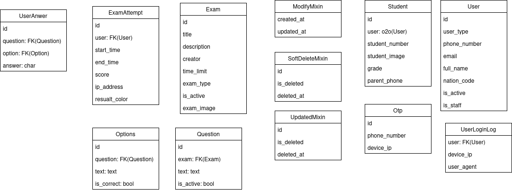

# 📘 exam_ict

یک سیستم آزمون آنلاین طراحی‌شده با Django و Docker.

---

## 🔗 Swagger UI

[مشاهده مستندات API](http://api.dxcode.ir/api/schema/swagger-ui)

---

## 📦 پیش‌نیازها

- Python 3.11 یا بالاتر
- Django 5.2 یا بالاتر
 −
---

## ⚙️ نصب

```bash
# نصب برای توسعه‌دهندگان
pip install -r requirements/development.txt

# نصب برای محیط تولید
pip install -r requirements/production.txt
